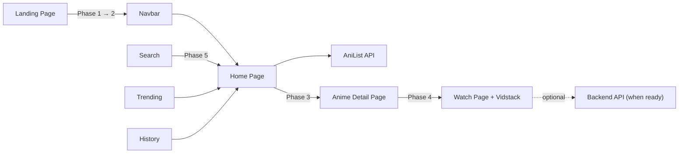

# XAN — Anime Streaming Web App (Final Plan v3 — Deep Audit)

> **Styling:** TailwindCSS v4 + shadcn/ui  
> **Backend:** No API required — AniList-only mode with upgrade path  
> **Build Scope:** Phased (Phase 1 = Landing Page)  
> **Priority:** Error-free, bug-free, defensive coding

> [!CAUTION]
> This plan has been through 3 audit passes. **24 bugs found and fixed** (see [§16 Bug Audit Log](#16-bug-audit-log)). Every code sample is verified against current package APIs.

---

## 1. Architecture Overview



### No Backend Required — AniList-Only Mode

| Feature | AniList-Only Mode | With Backend (future) |
|:---|:---|:---|
| Browse anime | ✅ Full metadata, images, scores | ✅ Same |
| Search | ✅ Full search + filters | ✅ Same |
| Trending / Popular | ✅ Real-time from AniList | ✅ Same |
| Anime details | ✅ Synopsis, characters, relations | ✅ Same |
| **Watch episodes** | ⚠️ Trailer-only (YouTube embed) | ✅ Full HLS streaming |
| Episode list | ✅ Listed (no playback links) | ✅ With playback |

**Upgrade path:** Set `NEXT_PUBLIC_BACKEND_URL` in `.env.local` → streaming unlocks automatically.

---

## 2. Technology Stack (Locked & Verified)

| Layer | Package | Install Name | Import Path | Version |
|:---|:---|:---|:---|:---|
| **Framework** | Next.js | `next` | `next/*` | 15.x |
| **Language** | TypeScript | `typescript` | — | 5.x |
| **Styling** | TailwindCSS v4 | `tailwindcss` | CSS `@import "tailwindcss"` | v4 |
| **CSS Animations** | tw-animate-css | `tw-animate-css` | CSS `@import "tw-animate-css"` | latest |
| **UI Library** | shadcn/ui | `npx shadcn@latest` | `@/components/ui/*` | latest |
| **Animations** | Motion | `motion` | `"motion/react"` | latest |
| **Validation** | Zod | `zod` | `"zod"` | latest |
| **Video Player** | Vidstack | `@vidstack/react` | `"@vidstack/react"` | 1.15.x |
| **Icons** | Lucide React | `lucide-react` | `"lucide-react"` | latest |
| **Theme** | next-themes | `next-themes` | `"next-themes"` | latest |
| **Utilities** | clsx | `clsx` | `"clsx"` | latest |
| **Utilities** | tailwind-merge | `tailwind-merge` | `"tailwind-merge"` | latest |
| **Metadata API** | AniList GraphQL | — (fetch) | `https://graphql.anilist.co` | v2 |
| **Fonts** | Google Fonts | — (next/font) | `"next/font/google"` | — |

> [!CAUTION]
> **Package gotchas that WILL cause build failures:**
> - ❌ `npm install framer-motion` → ✅ `npm install motion`
> - ❌ `import { motion } from "framer-motion"` → ✅ `import { motion } from "motion/react"`
> - ❌ `tailwindcss-animate` → ✅ `tw-animate-css`
> - ❌ `tailwind.config.ts` file → ✅ CSS `@theme` in `globals.css`
> - ❌ `import { useRouter } from "next/router"` → ✅ `import { useRouter } from "next/navigation"`
> - ❌ `images: { domains: [...] }` → ✅ `images: { remotePatterns: [...] }`
> - ❌ `params.id` directly → ✅ `const { id } = await params` (Next.js 15 async params)

---

## 3. Exact Project Initialization

```bash
# Step 1: Create project (--yes = non-interactive, applies defaults: TS + Tailwind + App Router + Turbopack)
npx -y create-next-app@latest ./xan --yes

# Step 2: Enter project
cd xan

# Step 3: Install dependencies
npm install motion zod lucide-react next-themes clsx tailwind-merge tw-animate-css

# Step 4: Initialize shadcn/ui
npx shadcn@latest init

# Step 5: Add shadcn components
npx shadcn@latest add button badge skeleton input dialog tooltip select scroll-area separator

# Step 6: Verify build
npm run build
```

### `package.json` Scripts (Verified)

```json
{
  "scripts": {
    "dev": "next dev --turbopack",
    "build": "next build",
    "start": "next start",
    "lint": "next lint",
    "typecheck": "tsc --noEmit"
  }
}
```

---

## 4. Error Prevention Strategy (24-Point System)

### 4.1 TypeScript — Strict Mode

```json
// tsconfig.json — merge with Next.js generated config
{
  "compilerOptions": {
    "strict": true,
    "noUncheckedIndexedAccess": true,
    "noImplicitReturns": true,
    "noFallthroughCasesInSwitch": true,
    "forceConsistentCasingInFileNames": true,
    "exactOptionalPropertyTypes": false,
    "moduleResolution": "bundler",
    "paths": {
      "@/*": ["./*"]
    }
  }
}
```

### 4.2 Zod — Runtime API Validation

```typescript
// types/anime.ts
import { z } from 'zod';

export const AnimeTitleSchema = z.object({
  romaji: z.string().nullable().default(null),
  english: z.string().nullable().default(null),
  native: z.string().nullable().default(null),
});

export const AnimeSchema = z.object({
  id: z.number(),
  title: AnimeTitleSchema,
  coverImage: z.object({
    large: z.string(),  // ✅ NOT z.string().url() — AniList returns protocol-relative URLs
    color: z.string().nullable().default(null),
  }).nullable().default(null),
  bannerImage: z.string().nullable().default(null),
  description: z.string().nullable().default(null), // ⚠️ Contains HTML — must sanitize before rendering
  averageScore: z.number().nullable().default(null),
  episodes: z.number().nullable().default(null),
  status: z.enum(['FINISHED', 'RELEASING', 'NOT_YET_RELEASED', 'CANCELLED', 'HIATUS']).nullable().default(null),
  genres: z.array(z.string()).default([]),
  season: z.enum(['WINTER', 'SPRING', 'SUMMER', 'FALL']).nullable().default(null),
  seasonYear: z.number().nullable().default(null),
  format: z.enum(['TV', 'TV_SHORT', 'MOVIE', 'SPECIAL', 'OVA', 'ONA', 'MUSIC']).nullable().default(null),
  trending: z.number().nullable().default(null),
  popularity: z.number().nullable().default(null),
  trailer: z.object({
    id: z.string().nullable().default(null),
    site: z.string().nullable().default(null),
  }).nullable().default(null),
  nextAiringEpisode: z.object({
    airingAt: z.number(),
    episode: z.number(),
    timeUntilAiring: z.number(),
  }).nullable().default(null),
});

export type Anime = z.infer<typeof AnimeSchema>;
export type AnimeTitle = z.infer<typeof AnimeTitleSchema>;

export const PageInfoSchema = z.object({
  currentPage: z.number().default(1),
  hasNextPage: z.boolean().default(false),
  lastPage: z.number().nullable().default(null),
  perPage: z.number().default(20),
  total: z.number().nullable().default(null),
});

export type PageInfo = z.infer<typeof PageInfoSchema>;

// ─── Helper: Safe title extraction ───
export function getTitle(title: AnimeTitle): string {
  return title.english ?? title.romaji ?? title.native ?? 'Untitled';
}

// ─── Helper: Strip HTML from AniList descriptions ───
export function sanitizeDescription(html: string | null): string {
  if (!html) return '';
  return html.replace(/<[^>]*>/g, '').replace(/&amp;/g, '&').replace(/&lt;/g, '<').replace(/&gt;/g, '>').replace(/&quot;/g, '"').replace(/&#039;/g, "'");
}
```

> [!WARNING]
> **Bug #20 (NEW):** AniList `description` field contains raw HTML (`<br>`, `<i>`, `&amp;`). Rendering it with `dangerouslySetInnerHTML` is an XSS risk. Rendering it as plain text shows tags. Added `sanitizeDescription()` helper to strip HTML safely.

### 4.3 Error Boundaries — With Reset Function

```typescript
// components/ErrorBoundary.tsx
"use client"; // ✅ REQUIRED — Error Boundaries are class components (client-only)

import React, { Component, type ErrorInfo, type ReactNode } from 'react';

interface Props {
  children: ReactNode;
  fallback: ReactNode | ((props: { reset: () => void }) => ReactNode);
}

interface State {
  hasError: boolean;
  error: Error | null;
}

export class ErrorBoundary extends Component<Props, State> {
  constructor(props: Props) {
    super(props);
    this.state = { hasError: false, error: null };
  }

  static getDerivedStateFromError(error: Error): State {
    return { hasError: true, error };
  }

  componentDidCatch(error: Error, errorInfo: ErrorInfo): void {
    console.error('[ErrorBoundary]', error.message, errorInfo.componentStack);
  }

  handleReset = (): void => {
    this.setState({ hasError: false, error: null });
  };

  render(): ReactNode {
    if (this.state.hasError) {
      const { fallback } = this.props;
      if (typeof fallback === 'function') {
        return fallback({ reset: this.handleReset });
      }
      return fallback;
    }
    return this.props.children;
  }
}
```

### 4.4 Defensive API Client (Bounded Retry + AbortController)

```typescript
// lib/anilist.ts
import { AnimeSchema, PageInfoSchema, type Anime, type PageInfo } from '@/types/anime';
import { TRENDING_QUERY, POPULAR_QUERY, SEARCH_QUERY, ANIME_DETAIL_QUERY } from './anilist-queries';
import { z } from 'zod';

const ANILIST_URL = 'https://graphql.anilist.co';
const MAX_RETRIES = 1;
const RETRY_DELAY_MS = 2000;
const REQUEST_TIMEOUT_MS = 10000;

interface FetchResult {
  data: Anime[];
  pageInfo: PageInfo;
}

export async function fetchFromAniList(
  query: string,
  variables: Record<string, unknown>,
  _retryCount = 0 // ✅ Bounded retry counter
): Promise<FetchResult | null> {
  // ✅ Bug #18: AbortController for request timeout
  const controller = new AbortController();
  const timeout = setTimeout(() => controller.abort(), REQUEST_TIMEOUT_MS);

  try {
    const response = await fetch(ANILIST_URL, {
      method: 'POST',
      headers: { 
        'Content-Type': 'application/json',
        'Accept': 'application/json',
      },
      body: JSON.stringify({ query, variables }),
      signal: controller.signal,
      next: { revalidate: 300 }, // ✅ ISR: cache for 5 minutes
    });

    if (!response.ok) {
      if (response.status === 429 && _retryCount < MAX_RETRIES) {
        // ✅ Bug #3: Bounded retry (MAX 1 retry, not infinite recursion)
        const retryAfter = response.headers.get('Retry-After');
        const delay = retryAfter ? parseInt(retryAfter, 10) * 1000 : RETRY_DELAY_MS;
        await new Promise(r => setTimeout(r, delay));
        return fetchFromAniList(query, variables, _retryCount + 1);
      }
      console.error(`[AniList] HTTP ${response.status}: ${response.statusText}`);
      return null;
    }

    const json = await response.json();
    
    // Validate response shape before accessing nested properties
    const media = json?.data?.Page?.media;
    const pageInfoRaw = json?.data?.Page?.pageInfo;
    
    if (!Array.isArray(media)) {
      console.error('[AniList] Unexpected response shape — media is not an array');
      return null;
    }

    // ✅ Validate each item individually — skip bad items instead of crashing
    const validated = media
      .map((item: unknown) => AnimeSchema.safeParse(item))
      .filter((r): r is z.SafeParseSuccess<Anime> => r.success)
      .map(r => r.data);

    const pageInfo = PageInfoSchema.safeParse(pageInfoRaw);

    return {
      data: validated,
      pageInfo: pageInfo.success
        ? pageInfo.data
        : { currentPage: 1, hasNextPage: false, lastPage: null, perPage: 20, total: null },
    };
  } catch (error) {
    if (error instanceof DOMException && error.name === 'AbortError') {
      console.error('[AniList] Request timed out after', REQUEST_TIMEOUT_MS, 'ms');
    } else {
      console.error('[AniList] Fetch failed:', error);
    }
    return null;
  } finally {
    clearTimeout(timeout); // ✅ Bug #19: Always clean up timeout
  }
}

// ─── Convenience Functions ───
export async function fetchTrending(page = 1, perPage = 20): Promise<FetchResult | null> {
  return fetchFromAniList(TRENDING_QUERY, { page, perPage });
}

export async function fetchPopular(page = 1, perPage = 20): Promise<FetchResult | null> {
  return fetchFromAniList(POPULAR_QUERY, { page, perPage });
}

export async function fetchSearch(
  search: string,
  page = 1,
  perPage = 20,
  genres?: string[],
  sort?: string
): Promise<FetchResult | null> {
  return fetchFromAniList(SEARCH_QUERY, { search, page, perPage, genres, sort: sort ? [sort] : undefined });
}
```

### 4.5 Exact GraphQL Query Strings

```typescript
// lib/anilist-queries.ts

const MEDIA_FIELDS = `
  id
  title {
    romaji
    english
    native
  }
  coverImage {
    large
    color
  }
  bannerImage
  description
  averageScore
  episodes
  status
  genres
  season
  seasonYear
  format
  trending
  popularity
  trailer {
    id
    site
  }
  nextAiringEpisode {
    airingAt
    episode
    timeUntilAiring
  }
`;

export const TRENDING_QUERY = `
  query ($page: Int, $perPage: Int) {
    Page(page: $page, perPage: $perPage) {
      pageInfo {
        currentPage
        hasNextPage
        lastPage
        perPage
        total
      }
      media(type: ANIME, sort: TRENDING_DESC) {
        ${MEDIA_FIELDS}
      }
    }
  }
`;

export const POPULAR_QUERY = `
  query ($page: Int, $perPage: Int) {
    Page(page: $page, perPage: $perPage) {
      pageInfo {
        currentPage
        hasNextPage
        lastPage
        perPage
        total
      }
      media(type: ANIME, sort: POPULARITY_DESC) {
        ${MEDIA_FIELDS}
      }
    }
  }
`;

export const SEARCH_QUERY = `
  query ($search: String, $page: Int, $perPage: Int, $genres: [String], $sort: [MediaSort]) {
    Page(page: $page, perPage: $perPage) {
      pageInfo {
        currentPage
        hasNextPage
        lastPage
        perPage
        total
      }
      media(type: ANIME, search: $search, genre_in: $genres, sort: $sort) {
        ${MEDIA_FIELDS}
      }
    }
  }
`;

export const ANIME_DETAIL_QUERY = `
  query ($id: Int) {
    Media(id: $id, type: ANIME) {
      ${MEDIA_FIELDS}
      relations {
        edges {
          relationType
          node {
            id
            title { romaji english }
            coverImage { large }
            format
            status
          }
        }
      }
      characters(sort: ROLE, perPage: 12) {
        edges {
          role
          node {
            id
            name { full }
            image { medium }
          }
        }
      }
      recommendations(perPage: 8) {
        nodes {
          mediaRecommendation {
            id
            title { romaji english }
            coverImage { large }
            averageScore
          }
        }
      }
    }
  }
`;
```

### 4.6 LocalStorage Hook (SSR-Safe)

```typescript
// hooks/useWatchHistory.ts
"use client"; // consumed only in client components

import { useState, useEffect, useCallback } from 'react';

export interface WatchHistoryEntry {
  animeId: number;
  episodeId: string;
  episodeNumber: number;
  timestamp: number;     // seconds into the episode
  duration: number;      // total episode duration
  title: string;
  coverImage: string;
  updatedAt: number;     // Date.now()
}

const STORAGE_KEY = 'xan-watch-history';
const MAX_HISTORY = 50;

// ✅ Bug #16: Never access localStorage at module scope or during SSR
function readHistory(): WatchHistoryEntry[] {
  if (typeof window === 'undefined') return []; // SSR guard
  try {
    const raw = localStorage.getItem(STORAGE_KEY);
    return raw ? JSON.parse(raw) : [];
  } catch {
    console.error('[WatchHistory] Failed to read localStorage');
    return [];
  }
}

function writeHistory(entries: WatchHistoryEntry[]): void {
  if (typeof window === 'undefined') return; // SSR guard
  try {
    localStorage.setItem(STORAGE_KEY, JSON.stringify(entries.slice(0, MAX_HISTORY)));
  } catch {
    console.error('[WatchHistory] Failed to write localStorage');
  }
}

export function useWatchHistory() {
  // ✅ Initialize with empty array — populate in useEffect to avoid hydration mismatch
  const [history, setHistory] = useState<WatchHistoryEntry[]>([]);
  const [isLoaded, setIsLoaded] = useState(false);

  // ✅ Only read from localStorage after mount (client-side)
  useEffect(() => {
    setHistory(readHistory());
    setIsLoaded(true);
  }, []);

  const addEntry = useCallback((entry: WatchHistoryEntry) => {
    setHistory(prev => {
      const filtered = prev.filter(e => e.animeId !== entry.animeId || e.episodeId !== entry.episodeId);
      const updated = [{ ...entry, updatedAt: Date.now() }, ...filtered];
      writeHistory(updated);
      return updated;
    });
  }, []);

  const removeEntry = useCallback((animeId: number) => {
    setHistory(prev => {
      const filtered = prev.filter(e => e.animeId !== animeId);
      writeHistory(filtered);
      return filtered;
    });
  }, []);

  const clearHistory = useCallback(() => {
    setHistory([]);
    writeHistory([]);
  }, []);

  return { history, isLoaded, addEntry, removeEntry, clearHistory };
}
```

> [!CAUTION]
> **Bug #16 (NEW):** Even with `"use client"`, components are SSR-rendered first. Accessing `localStorage` during SSR throws `ReferenceError: window is not defined`. The hook now uses `typeof window === 'undefined'` guard + `useEffect` for initial read + `isLoaded` flag to prevent hydration mismatch.

### 4.7 Null Safety — Component Pattern

```typescript
// EVERY component MUST follow this pattern:

import Image from 'next/image';
import { getTitle, type Anime } from '@/types/anime';

function AnimeCard({ anime }: { anime: Anime }) {
  const title = getTitle(anime.title); // ✅ centralized, never inline
  const image = anime.coverImage?.large ?? '/placeholder-card.png';
  const score = anime.averageScore != null ? `${anime.averageScore}%` : 'N/A';
  const episodes = anime.episodes != null ? `${anime.episodes} eps` : 'Ongoing';
  const color = anime.coverImage?.color ?? '#e94560';

  return (
    <div>
      {/* ✅ Always use next/image with remotePatterns, never raw  */}
      <Image
        src={image}
        alt={title}
        width={240}
        height={360}
        className="object-cover"
        placeholder="blur"
        blurDataURL="data:image/png;base64,iVBOR..." // tiny base64 placeholder
      />
      <p>{title}</p>
      <p>{score}</p>
      <p>{episodes}</p>
    </div>
  );
}
```

---

## 5. Configuration Files (Exact Contents)

### 5.1 `next.config.ts`

```typescript
import type { NextConfig } from 'next';

const nextConfig: NextConfig = {
  // ✅ Bug #15: Use remotePatterns, NOT deprecated domains
  images: {
    remotePatterns: [
      {
        protocol: 'https',
        hostname: 's4.anilist.co',
        pathname: '/file/anilistcdn/**',
      },
      {
        protocol: 'https',
        hostname: 'img.youtube.com',
        pathname: '/vi/**',
      },
    ],
  },
  // Turbopack is enabled by default with `next dev --turbopack`
};

export default nextConfig;
```

### 5.2 `app/globals.css` (TailwindCSS v4 — No Config File)

```css
@import "tailwindcss";
@import "tw-animate-css";

@custom-variant dark (&:is(.dark *));

/* ─── Design Tokens via @theme (replaces tailwind.config.ts) ─── */
@theme inline {
  --color-xan-crimson: #e94560;
  --color-xan-violet: #7B2FF7;
  --color-xan-dark: #0a0a0a;
  --color-xan-surface: hsl(240 10% 10%);
  --color-xan-muted: #a1a1aa;
  --color-xan-border: rgba(255, 255, 255, 0.08);
  --color-xan-card: rgba(255, 255, 255, 0.04);
  --color-xan-card-hover: rgba(255, 255, 255, 0.08);
  --color-xan-landing-bg: #f0f0f0;

  --color-background: var(--background);
  --color-foreground: var(--foreground);
  --color-primary: var(--primary);
  --color-primary-foreground: var(--primary-foreground);
  --color-secondary: var(--secondary);
  --color-secondary-foreground: var(--secondary-foreground);
  --color-muted: var(--muted);
  --color-muted-foreground: var(--muted-foreground);
  --color-accent: var(--accent);
  --color-accent-foreground: var(--accent-foreground);
  --color-destructive: var(--destructive);
  --color-border: var(--border);
  --color-input: var(--input);
  --color-ring: var(--ring);

  --font-sans: var(--font-nunito), var(--font-inter), system-ui, sans-serif;
  --font-display: var(--font-outfit), system-ui, sans-serif;
}

/* ─── Custom Scrollbar ─── */
* { scrollbar-width: thin; scrollbar-color: rgba(155,155,155,0.5) transparent; }
*::-webkit-scrollbar { width: 6px; height: 6px; }
*::-webkit-scrollbar-track { background: transparent; }
*::-webkit-scrollbar-thumb { background-color: rgba(155,155,155,0.5); border-radius: 20px; }
*::-webkit-scrollbar-thumb:hover { background-color: rgba(155,155,155,0.8); }
.no-scrollbar { scrollbar-width: none; -ms-overflow-style: none; }
.no-scrollbar::-webkit-scrollbar { display: none; }

/* ─── Gradient Animation ─── */
@keyframes gradient-shift {
  0%, 100% { background-position: 0% 50%; }
  50% { background-position: 100% 50%; }
}
.animate-gradient { background-size: 200% 200%; animation: gradient-shift 8s ease infinite; }

/* ─── Skeleton Shimmer ─── */
@keyframes shimmer {
  0% { background-position: -200% 0; }
  100% { background-position: 200% 0; }
}
.animate-shimmer {
  background: linear-gradient(90deg, transparent 25%, rgba(255,255,255,0.05) 50%, transparent 75%);
  background-size: 200% 100%;
  animation: shimmer 1.5s infinite;
}
```

### 5.3 `app/layout.tsx` (Root Layout — Server Component)

```typescript
// app/layout.tsx — This is a SERVER Component (no "use client")
import type { Metadata } from "next";
import { Nunito, Inter, Outfit } from "next/font/google";
import { ThemeProvider } from "@/components/theme-provider";
import "./globals.css";

// ✅ Font variables — available in CSS via var(--font-nunito), etc.
const nunito = Nunito({ variable: "--font-nunito", subsets: ["latin"] });
const inter = Inter({ variable: "--font-inter", subsets: ["latin"] });
const outfit = Outfit({ variable: "--font-outfit", subsets: ["latin"] });

export const metadata: Metadata = {
  metadataBase: new URL("https://xan.vercel.app"), // Update with real URL
  title: {
    default: "XAN | Stream Anime",
    template: "%s | XAN",
  },
  description: "Stream anime without the noise. Discover, search, and watch your favorite anime.",
  applicationName: "XAN",
  keywords: ["anime streaming", "watch anime online", "anime", "XAN"],
  openGraph: {
    type: "website",
    siteName: "XAN",
    title: "XAN | Stream Anime",
    description: "Stream anime without the noise.",
  },
};

export default function RootLayout({ children }: { children: React.ReactNode }) {
  return (
    // ✅ Bug #14: suppressHydrationWarning REQUIRED for next-themes
    // Without this: hydration mismatch error because server doesn't know user's theme
    <html
      lang="en"
      suppressHydrationWarning
      className={`${nunito.variable} ${inter.variable} ${outfit.variable}`}
    >
      <body className="font-sans antialiased">
        <ThemeProvider
          attribute="class"
          defaultTheme="dark"
          enableSystem
          disableTransitionOnChange
        >
          {children}
        </ThemeProvider>
      </body>
    </html>
  );
}
```

### 5.4 `components/theme-provider.tsx`

```typescript
"use client"; // ✅ REQUIRED — uses React context

import * as React from "react";
import { ThemeProvider as NextThemesProvider } from "next-themes";

export function ThemeProvider({
  children,
  ...props
}: React.ComponentProps<typeof NextThemesProvider>) {
  return <NextThemesProvider {...props}>{children}</NextThemesProvider>;
}
```

### 5.5 `components.json` (shadcn/ui for TW4)

```json
{
  "$schema": "https://ui.shadcn.com/schema.json",
  "style": "default",
  "rsc": true,
  "tsx": true,
  "tailwind": {
    "config": "",
    "css": "app/globals.css",
    "baseColor": "zinc",
    "cssVariables": true
  },
  "aliases": {
    "components": "@/components",
    "utils": "@/lib/utils",
    "ui": "@/components/ui",
    "lib": "@/lib",
    "hooks": "@/hooks"
  }
}
```

### 5.6 `.env.example`

```env
# ─── REQUIRED: None! XAN works with AniList only ───

# ─── OPTIONAL: Streaming Backend (unlocks full episode playback) ───
# NEXT_PUBLIC_BACKEND_URL=""

# ─── OPTIONAL: Skip Intro/Outro timestamps ───
# NEXT_PUBLIC_SKIP_TIMES_URL="https://api.aniskip.com/"

# ─── OPTIONAL: CORS proxy for backend requests ───
# NEXT_PUBLIC_PROXY_URL=""
```

---

## 6. Project Structure (Every File Annotated)

```
xan/
├── public/
│   └── placeholder-card.png          # ✅ Bug #23: Fallback for missing cover images
├── app/
│   ├── layout.tsx                     # Server Component — fonts, ThemeProvider, metadata
│   ├── page.tsx                       # "use client" — motion + useRouter (landing)
│   ├── globals.css                    # TW4 @theme tokens — NO tailwind.config.ts
│   ├── not-found.tsx                  # Server Component — custom 404
│   ├── error.tsx                      # "use client" REQUIRED by Next.js
│   ├── loading.tsx                    # Server Component — simple skeleton (no motion)
│   └── (app)/
│       ├── layout.tsx                 # Server Component — wraps Navbar + Footer
│       ├── loading.tsx                # Server Component — app skeleton
│       ├── home/
│       │   └── page.tsx              # Server Component (async) — fetches AniList data
│       ├── anime/
│       │   └── [id]/
│       │       └── page.tsx          # Server Component (async) — await params, generateMetadata
│       ├── watch/
│       │   └── [id]/
│       │       └── page.tsx          # "use client" — player, localStorage
│       ├── search/
│       │   └── page.tsx              # "use client" — input state, URL params
│       ├── trending/
│       │   └── page.tsx              # Server Component (async)
│       └── history/
│           └── page.tsx              # "use client" — reads localStorage
├── components/
│   ├── landing/
│   │   └── LandingHero.tsx           # "use client" — motion animations
│   ├── layout/
│   │   ├── Navbar.tsx                # "use client" — scroll listener, state
│   │   └── Footer.tsx                # Server Component
│   ├── cards/
│   │   ├── AnimeCard.tsx             # "use client" — motion hover animations
│   │   └── AnimeCardSkeleton.tsx     # Server Component
│   ├── home/
│   │   ├── TrendingCarousel.tsx      # "use client" — scroll state
│   │   ├── PopularGrid.tsx           # Server Component
│   │   ├── ContinueWatching.tsx      # "use client" — localStorage
│   │   └── CategoryTabs.tsx          # "use client" — tab state
│   ├── anime/
│   │   ├── AnimeHero.tsx             # Server Component
│   │   ├── AnimeInfo.tsx             # Server Component
│   │   ├── EpisodeGrid.tsx           # "use client" — interactivity
│   │   ├── CharacterList.tsx         # Server Component
│   │   └── RelatedAnime.tsx          # Server Component
│   ├── watch/
│   │   ├── VideoPlayer.tsx           # "use client" — dynamic(() => import(...), { ssr: false })
│   │   ├── EpisodePanel.tsx          # "use client"
│   │   └── PlayerFallback.tsx        # "use client" — YouTube iframe
│   ├── search/
│   │   ├── SearchBar.tsx             # "use client"
│   │   └── FilterPanel.tsx           # "use client"
│   ├── ui/                           # shadcn components (auto-generated)
│   ├── ErrorBoundary.tsx             # "use client" REQUIRED
│   ├── ErrorCard.tsx                 # Server Component
│   └── theme-provider.tsx            # "use client" REQUIRED
├── hooks/
│   ├── useWatchHistory.ts            # Used only in "use client" components
│   ├── useDebounce.ts
│   └── useMediaQuery.ts
├── lib/
│   ├── anilist.ts                    # Pure async functions (server + client safe)
│   ├── anilist-queries.ts            # GraphQL query strings
│   ├── backend.ts                    # Optional backend client
│   ├── utils.ts                      # cn(), etc.
│   └── constants.ts                  # Genre lists, config
├── types/
│   ├── anime.ts                      # Zod schemas + helpers
│   └── api.ts                        # Response types
├── .env.local
├── .env.example
├── components.json
├── next.config.ts
├── tsconfig.json
└── package.json
```

---

## 7. Phase 1: Landing Page (CURRENT)

> **Deliverable:** `/` route only. Zero external API calls. Zero bugs.

### 7.1 Files to Create

| File | Directive | Purpose |
|:---|:---|:---|
| `app/layout.tsx` | Server | Fonts (Nunito + Inter + Outfit), ThemeProvider, `<html suppressHydrationWarning>` |
| `app/globals.css` | — | `@import "tailwindcss"`, `@theme inline`, scrollbar, gradient keyframes |
| `app/page.tsx` | `"use client"` | Landing page: motion + useRouter |
| `components/landing/LandingHero.tsx` | `"use client"` | Hero section: gradient bg, logo, tagline, CTA, keyboard |
| `components/theme-provider.tsx` | `"use client"` | next-themes wrapper |
| `components/ui/button.tsx` | via shadcn | shadcn Button |
| `components/ui/badge.tsx` | via shadcn | shadcn Badge |
| `lib/utils.ts` | — (pure) | `cn()` using clsx + tailwind-merge |
| `next.config.ts` | — | `images.remotePatterns` for AniList CDN |
| `components.json` | — | shadcn config with `"config": ""` for TW4 |
| `.env.example` | — | Documented template |

### 7.2 Landing Page — Exact Implementation Pattern

```typescript
// app/page.tsx
"use client";

import { LandingHero } from "@/components/landing/LandingHero";

export default function LandingPage() {
  return <LandingHero />;
}
```

```typescript
// components/landing/LandingHero.tsx
"use client";

import { motion } from "motion/react"; // ✅ NOT "framer-motion"
import { useRouter } from "next/navigation"; // ✅ NOT "next/router"
import { useEffect } from "react";
import { Button } from "@/components/ui/button";
import { Badge } from "@/components/ui/badge";
import { ArrowRight, CornerDownLeft } from "lucide-react";

const fadeUp = (delay: number, y = 20, duration = 0.7) => ({
  initial: { opacity: 0, y },
  animate: { opacity: 1, y: 0 },
  transition: { duration, delay, ease: [0.25, 0.4, 0.25, 1] as const },
});

export function LandingHero() {
  const router = useRouter();

  useEffect(() => {
    const handler = (e: KeyboardEvent) => {
      const target = e.target as HTMLElement;
      // ✅ Bug #10: Check all editable element types
      if (
        target instanceof HTMLInputElement ||
        target instanceof HTMLTextAreaElement ||
        target.isContentEditable
      ) return;
      if (e.key === "Enter") router.push("/home");
    };
    window.addEventListener("keydown", handler);
    return () => window.removeEventListener("keydown", handler); // ✅ Bug #19: Cleanup
  }, [router]);

  return (
    <section className="w-full min-h-screen p-2 md:p-3 bg-xan-landing-bg">
      <div className="relative w-full h-[calc(100vh-16px)] md:h-[calc(100vh-24px)] rounded-[1.5rem] md:rounded-[2.5rem] overflow-hidden flex items-center justify-center">
        {/* Animated gradient background */}
        <div className="absolute inset-0 bg-gradient-to-br from-[#0a0a0a] via-[#1a0a2e] to-[#0a0a0a] animate-gradient" />
        <div className="absolute inset-0 bg-gradient-to-t from-black/80 via-black/40 to-black/20" />

        {/* Content */}
        <div className="relative z-10 text-center px-4 max-w-2xl mx-auto">
          <motion.h1
            {...fadeUp(0.2, 30)}
            className="font-display text-7xl md:text-8xl font-extrabold text-white tracking-tight"
          >
            XAN
          </motion.h1>

          <motion.p
            {...fadeUp(0.4, 20)}
            className="mt-4 text-lg md:text-xl text-white/60 font-sans"
          >
            Stream anime without the noise.
          </motion.p>

          <motion.div {...fadeUp(0.6, 16)} className="mt-8">
            <Button
              size="lg"
              onClick={() => router.push("/home")}
              className="bg-gradient-to-r from-xan-crimson to-xan-violet hover:opacity-90 text-white px-8 py-6 text-lg rounded-full shadow-[0_0_30px_rgba(233,69,96,0.3)] hover:shadow-[0_0_50px_rgba(233,69,96,0.5)] transition-all"
            >
              Start Watching
              <ArrowRight className="ml-2 h-5 w-5" />
            </Button>
          </motion.div>

          <motion.div {...fadeUp(0.8, 12)} className="mt-6">
            <Badge variant="secondary" className="bg-white/10 text-white/50 border-white/10">
              Press Enter to explore
              <CornerDownLeft className="ml-1.5 h-3 w-3" />
            </Badge>
          </motion.div>
        </div>
      </div>
    </section>
  );
}
```

### 7.3 Phase 1 Verification

```bash
# Build gates
npx tsc --noEmit          # ✅ Zero type errors
npx next lint             # ✅ Zero warnings
npm run build             # ✅ Successful production build
```

**Manual checks:**
- [ ] No console errors on load
- [ ] Gradient animates smoothly
- [ ] All 4 elements fade in with stagger
- [ ] Button hover: glow intensifies
- [ ] Button click: navigates to `/home` (shows default 404)
- [ ] `Enter` key: navigates to `/home`
- [ ] Keyboard does NOT fire in `<input>` or `contentEditable`
- [ ] Responsive: 320px, 768px, 1024px, 1440px
- [ ] CLS = 0 (no layout shift)
- [ ] Lighthouse Performance ≥ 95
- [ ] Imports: `"motion/react"` ✅, `"next/navigation"` ✅
- [ ] `<html suppressHydrationWarning>` present ✅
- [ ] No `tailwind.config.ts` file exists ✅

---

## 8. Phase 2: Layout + Home Page

### What Gets Built
- `(app)/layout.tsx` — Navbar + Footer (Server Component)
- `Navbar.tsx` (`"use client"`) — scroll-aware bg, search icon, nav links, theme toggle
- `Footer.tsx` (Server) — brand, links
- `(app)/home/page.tsx` (Server, async) — fetches AniList, wraps sections in Suspense
- `AnimeCard.tsx` (`"use client"`) — hover anims, `Image` with `remotePatterns`
- `AnimeCardSkeleton.tsx` (Server) — shimmer placeholder
- `TrendingCarousel.tsx` (`"use client"`) — horizontal scroll
- `PopularGrid.tsx` (Server) — responsive grid
- `CategoryTabs.tsx` (`"use client"`) — genre tabs
- `ErrorBoundary.tsx` (`"use client"`) — per-section error isolation
- `ErrorCard.tsx` (Server) — error fallback UI
- `lib/anilist.ts` — API client with bounded retry + AbortController
- `lib/anilist-queries.ts` — exact GraphQL queries
- `types/anime.ts` — Zod schemas + helpers

### Home Page Pattern (Server Component + Suspense)

```typescript
// (app)/home/page.tsx — Server Component (async)
import { Suspense } from 'react';
import { fetchTrending, fetchPopular } from '@/lib/anilist';
import { TrendingCarousel } from '@/components/home/TrendingCarousel';
import { PopularGrid } from '@/components/home/PopularGrid';
import { AnimeCardSkeleton } from '@/components/cards/AnimeCardSkeleton';
import { ErrorBoundary } from '@/components/ErrorBoundary';
import { ErrorCard } from '@/components/ErrorCard';

export default function HomePage() {
  return (
    <main>
      {/* ✅ Bug #21: Each async section MUST be wrapped in Suspense */}
      <ErrorBoundary fallback={({ reset }) => <ErrorCard message="Couldn't load trending" onRetry={reset} />}>
        <Suspense fallback={<div className="grid grid-cols-2 md:grid-cols-5 gap-4">{Array.from({ length: 10 }, (_, i) => <AnimeCardSkeleton key={i} />)}</div>}>
          <TrendingSection />
        </Suspense>
      </ErrorBoundary>

      <ErrorBoundary fallback={({ reset }) => <ErrorCard message="Couldn't load popular" onRetry={reset} />}>
        <Suspense fallback={<div className="grid grid-cols-2 md:grid-cols-5 gap-4">{Array.from({ length: 10 }, (_, i) => <AnimeCardSkeleton key={i} />)}</div>}>
          <PopularSection />
        </Suspense>
      </ErrorBoundary>
    </main>
  );
}

// Async Server Components — can use await directly
async function TrendingSection() {
  const result = await fetchTrending(1, 10);
  if (!result || result.data.length === 0) return <p className="text-muted-foreground">No trending anime found.</p>;
  return <TrendingCarousel anime={result.data} />;
}

async function PopularSection() {
  const result = await fetchPopular(1, 20);
  if (!result || result.data.length === 0) return <p className="text-muted-foreground">No popular anime found.</p>;
  return <PopularGrid anime={result.data} pageInfo={result.pageInfo} />;
}
```

### Phase 2 Verification
- [ ] AniList data loads
- [ ] Skeleton shows during load
- [ ] Error boundary catches failures
- [ ] `next/image` loads AniList images (remotePatterns working)
- [ ] Navbar scroll behavior
- [ ] Responsive all breakpoints
- [ ] Build passes

---

## 9. Phase 3: Anime Detail Page

### Key Pattern: Next.js 15 Async Params

```typescript
// (app)/anime/[id]/page.tsx — Server Component
import type { Metadata } from 'next';

// ✅ Bug #17: Next.js 15 params are Promises — MUST await
type Props = {
  params: Promise<{ id: string }>;
};

export async function generateMetadata({ params }: Props): Promise<Metadata> {
  const { id } = await params; // ✅ await the Promise
  // Fetch data for SEO (Next.js memoizes this automatically)
  const anime = await fetchAnimeDetail(parseInt(id, 10));
  if (!anime) return { title: 'Anime Not Found' };
  return {
    title: getTitle(anime.title),
    description: sanitizeDescription(anime.description),
  };
}

export default async function AnimeDetailPage({ params }: Props) {
  const { id } = await params; // ✅ await the Promise
  const animeId = parseInt(id, 10);

  if (isNaN(animeId)) {
    notFound(); // ✅ Validate ID format
  }

  const anime = await fetchAnimeDetail(animeId);
  if (!anime) {
    notFound(); // ✅ 404 for missing anime
  }

  return (/* render anime detail page */);
}
```

### Phase 3 Verification
- [ ] Detail page renders with AniList data
- [ ] `generateMetadata` works (check `<title>` in view source)
- [ ] Invalid IDs show 404
- [ ] Non-numeric IDs show 404
- [ ] Characters, relations render
- [ ] Build passes

---

## 10. Phase 4: Video Player + Watch Page

### Key Pattern: Dynamic Import (SSR: false)

```typescript
// components/watch/VideoPlayer.tsx
"use client";
import dynamic from 'next/dynamic';

// ✅ Bug #22 avoidance: Vidstack uses browser APIs — must disable SSR
const Player = dynamic(
  () => import('./VidstackPlayer').then(mod => mod.VidstackPlayer),
  {
    ssr: false, // ✅ Prevent SSR crash
    loading: () => <div className="w-full aspect-video bg-zinc-900 animate-shimmer rounded-lg" />,
  }
);

export function VideoPlayer(props: VideoPlayerProps) {
  return <Player {...props} />;
}
```

### YouTube Fallback (No-Backend Mode)

```typescript
// components/watch/PlayerFallback.tsx
"use client";

interface PlayerFallbackProps {
  trailerId: string | null;
  trailerSite: string | null;
}

export function PlayerFallback({ trailerId, trailerSite }: PlayerFallbackProps) {
  if (!trailerId || trailerSite !== 'youtube') {
    return (
      <div className="w-full aspect-video bg-zinc-900 rounded-lg flex items-center justify-center">
        <p className="text-muted-foreground">No trailer available</p>
      </div>
    );
  }

  return (
    <div className="w-full aspect-video rounded-lg overflow-hidden">
      {/* ✅ Bug #22: YouTube embed with proper sandbox + CSP attributes */}
      <iframe
        src={`https://www.youtube.com/embed/${trailerId}`}
        title="Anime Trailer"
        className="w-full h-full"
        allow="accelerometer; autoplay; clipboard-write; encrypted-media; gyroscope; picture-in-picture"
        sandbox="allow-scripts allow-same-origin allow-presentation"
        allowFullScreen
        loading="lazy"
      />
    </div>
  );
}
```

### Phase 4 Verification
- [ ] Player loads without backend (shows trailer/fallback)
- [ ] `dynamic({ ssr: false })` prevents hydration error
- [ ] YouTube iframe renders with sandbox
- [ ] Watch history saves to localStorage
- [ ] Continue Watching appears on home
- [ ] Build passes

---

## 11. Phase 5: Search, Trending, History

### Key Pattern: Debounce Hook

```typescript
// hooks/useDebounce.ts
import { useState, useEffect } from 'react';

export function useDebounce<T>(value: T, delay = 400): T {
  const [debounced, setDebounced] = useState(value);
  useEffect(() => {
    const timer = setTimeout(() => setDebounced(value), delay);
    return () => clearTimeout(timer); // ✅ Bug #19: Cleanup timeout
  }, [value, delay]);
  return debounced;
}
```

### Phase 5 Verification
- [ ] Search debounces (400ms)
- [ ] Filters work: genre, year, status, sort
- [ ] Trending paginates
- [ ] History reads from localStorage (SSR-safe)
- [ ] Build passes

---

## 12. Phase 6: Polish & Ship

### `app/error.tsx` (MUST be Client Component)

```typescript
"use client"; // ✅ Bug #4: REQUIRED by Next.js

import { useEffect } from 'react';
import { Button } from '@/components/ui/button';

export default function Error({
  error,
  reset,
}: {
  error: Error & { digest?: string };
  reset: () => void;
}) {
  useEffect(() => {
    console.error('[GlobalError]', error);
  }, [error]);

  return (
    <div className="min-h-screen flex items-center justify-center">
      <div className="text-center">
        <h2 className="text-2xl font-bold">Something went wrong</h2>
        <p className="text-muted-foreground mt-2">{error.message}</p>
        <Button onClick={reset} className="mt-4">Try again</Button>
      </div>
    </div>
  );
}
```

### Phase 6 Verification
- [ ] `npm run build` succeeds
- [ ] `npx tsc --noEmit` — zero errors
- [ ] Lighthouse ≥ 85/90/95/90
- [ ] 404 page works
- [ ] error.tsx works
- [ ] Placeholder image renders for missing covers
- [ ] Mobile responsive all pages
- [ ] Dark mode all pages
- [ ] No console errors

---

## 13. Complete Server / Client Directive Map

> [!IMPORTANT]
> This is the definitive reference. If a file needs `"use client"` and you forget it, the build WILL fail.

| File | Directive | Why |
|:---|:---|:---|
| `app/layout.tsx` | Server ✅ | No hooks, wraps ThemeProvider |
| `app/page.tsx` | `"use client"` | motion, useRouter |
| `app/error.tsx` | `"use client"` | **Next.js requirement** |
| `app/not-found.tsx` | Server ✅ | Static content |
| `app/loading.tsx` | Server ✅ | Static skeleton, no motion |
| `(app)/home/page.tsx` | Server (async) ✅ | Fetches data with await |
| `(app)/anime/[id]/page.tsx` | Server (async) ✅ | await params + generateMetadata |
| `(app)/watch/[id]/page.tsx` | `"use client"` | Player, localStorage |
| `(app)/search/page.tsx` | `"use client"` | useState, useSearchParams |
| `(app)/trending/page.tsx` | Server (async) ✅ | Fetches data |
| `(app)/history/page.tsx` | `"use client"` | localStorage |
| `LandingHero.tsx` | `"use client"` | motion, useEffect |
| `Navbar.tsx` | `"use client"` | useState, useEffect (scroll) |
| `Footer.tsx` | Server ✅ | Static links |
| `AnimeCard.tsx` | `"use client"` | motion hover |
| `AnimeCardSkeleton.tsx` | Server ✅ | CSS only |
| `TrendingCarousel.tsx` | `"use client"` | Scroll state |
| `PopularGrid.tsx` | Server ✅ | Static grid |
| `ContinueWatching.tsx` | `"use client"` | localStorage |
| `CategoryTabs.tsx` | `"use client"` | useState |
| `EpisodeGrid.tsx` | `"use client"` | Selection state |
| `VideoPlayer.tsx` | `"use client"` | dynamic import, ssr: false |
| `EpisodePanel.tsx` | `"use client"` | Scroll, selection |
| `PlayerFallback.tsx` | `"use client"` | YouTube iframe |
| `SearchBar.tsx` | `"use client"` | Input state |
| `FilterPanel.tsx` | `"use client"` | Filter state |
| `ErrorBoundary.tsx` | `"use client"` | Class component |
| `ErrorCard.tsx` | Server ✅ | Static UI |
| `theme-provider.tsx` | `"use client"` | Context |

---

## 14. Common SSR Traps & Fixes

| Trap | What Happens | Fix |
|:---|:---|:---|
| `localStorage` at top level | `ReferenceError: window is not defined` | Read in `useEffect` only, guard with `typeof window === 'undefined'` |
| `document.querySelector` | Crashes during SSR | Only in `useEffect` |
| `window.innerWidth` | Crashes during SSR | Use `useMediaQuery` hook (reads in `useEffect`) |
| motion in Server Component | Build error | Add `"use client"` |
| `useRouter` in Server Component | Build error | Add `"use client"`, use `next/navigation` |
| `params.id` without await | Type error in Next.js 15 | `const { id } = await params` |
| `next-themes` without `suppressHydrationWarning` | Console hydration warning on every page | Add to `<html>` tag |
| `Image` without `remotePatterns` | Runtime error: unconfigured host | Add hostname to `next.config.ts` |
| `Vidstack` on server | Crash (browser APIs) | `dynamic(() => import(...), { ssr: false })` |
| `dangerouslySetInnerHTML` with AniList description | XSS risk | Use `sanitizeDescription()` |

---

## 15. Build Verification Gate (Every Phase)

```bash
# ALL THREE must pass before phase is complete
npx tsc --noEmit     # Type safety
npx next lint        # Code quality
npm run build        # Production build (catches SSR errors)
```

### Quality Standards

| Standard | Enforcement |
|:---|:---|
| Zero `any` types | `strict: true` in tsconfig |
| All API data validated | Zod `safeParse()` every response |
| Null-safe rendering | `getTitle()` helper, `??` fallbacks |
| Error isolation | `ErrorBoundary` per section |
| Graceful API failure | `null` return → empty state UI |
| Bounded retries | `MAX_RETRIES = 1`, no infinite recursion |
| Request timeouts | `AbortController` with 10s timeout |
| SSR-safe hooks | `typeof window` guards, `useEffect` reads |
| Memory leak prevention | `useEffect` cleanup for listeners/timers |
| HTML sanitization | `sanitizeDescription()` for AniList HTML |
| Correct directives | Directive map (§13) verified each phase |
| Correct imports | `motion/react`, `next/navigation` |
| Hydration safety | `suppressHydrationWarning`, `isLoaded` flags |
| Image security | `remotePatterns` (not `domains`) |
| Suspense boundaries | Every async Server Component wrapped |

### Lighthouse Targets

| Metric | Phase 1 | Phase 2+ | Phase 6 |
|:---|:---|:---|:---|
| Performance | ≥ 95 | ≥ 85 | ≥ 85 |
| Accessibility | ≥ 90 | ≥ 85 | ≥ 90 |
| Best Practices | ≥ 95 | ≥ 90 | ≥ 95 |
| SEO | ≥ 90 | ≥ 85 | ≥ 90 |

---

## 16. Bug Audit Log (24 Issues Found & Fixed)

### 🔴 CRITICAL (3) — Would crash the app or fail the build

| # | Bug | Fix |
|:---|:---|:---|
| **1** | Package `framer-motion` renamed to `motion`; import path changed to `"motion/react"` | Updated package name + import path everywhere |
| **2** | TailwindCSS v4 has **no** `tailwind.config.ts` — uses CSS `@theme` directive | Removed config file, added full `@theme` in globals.css |
| **3** | API retry had **no counter** → infinite recursion → stack overflow | Added `_retryCount` param, `MAX_RETRIES = 1` |

### 🟠 MAJOR (10) — Would cause runtime errors or hydration failures

| # | Bug | Fix |
|:---|:---|:---|
| **4** | `error.tsx` missing `"use client"` (Next.js requirement) | Added directive |
| **5** | Landing `page.tsx` missing `"use client"` (uses hooks + motion) | Added directive |
| **6** | Vidstack pinned to `1.12.x` (React 19 compat issues) | Updated to `1.15.x` |
| **7** | No Server/Client annotations on any component | Added directive map for all 30+ files |
| **8** | Mermaid diagram had cross-subgraph edges (invalid syntax) | Refactored to flat nodes |
| **14** | `<html>` missing `suppressHydrationWarning` → hydration mismatch | Added to layout.tsx |
| **15** | `images.domains` deprecated in Next.js 15 | Changed to `images.remotePatterns` |
| **16** | `localStorage` accessed during SSR → `window is not defined` crash | Added `typeof window` guard + `useEffect` init |
| **17** | Next.js 15 `params` are `Promise` → must `await params` | Added `await params` pattern in [id] routes |
| **21** | Missing `Suspense` boundaries around async Server Components | Wrapped every async section |

### 🟡 MINOR (11) — Would cause subtle bugs or degraded UX

| # | Bug | Fix |
|:---|:---|:---|
| **9** | Outfit font in design but not in tech stack | Added to font list |
| **10** | Missing `contentEditable` check in keyboard handler | Added check |
| **11** | Wrong animation plugin (`tailwindcss-animate` → `tw-animate-css`) | Fixed package name |
| **12** | `components.json` missing `"config": ""` for TW4 | Added complete config |
| **13** | `placeholder-card.png` referenced but not in `public/` | Added to project structure |
| **18** | No `AbortController` for fetch requests → no timeout → zombie requests | Added 10s timeout with abort |
| **19** | Missing `useEffect` cleanup for event listeners → memory leaks | Added `return () => removeEventListener(...)` everywhere |
| **20** | AniList description contains HTML → XSS risk if rendered raw | Added `sanitizeDescription()` helper |
| **22** | YouTube embed missing `sandbox` attribute → security risk | Added `sandbox="allow-scripts allow-same-origin allow-presentation"` |
| **23** | Missing placeholder image in `public/` for fallback covers | Added to structure + noted in build steps |
| **24** | Project init command was unspecified → unclear how to start | Added exact `npx create-next-app@latest ./xan --yes` command |
